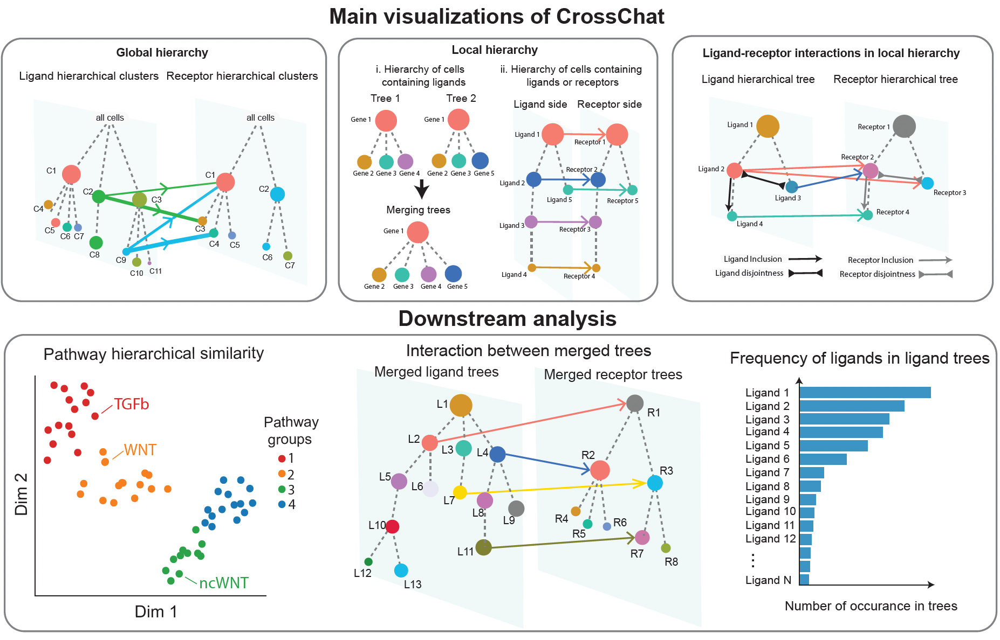

# *CrossChat*

This ``python`` package is designed to detect and analyze hierarchical structures within cell-cell communications (CCC).

### Installation from GitHub 

You can install the source code of this package from GitHub directly by first cloning this repo with:
```
git clone https://github.com/Xinyiw28/CrossChat.git
cd CrossChat
pip install -r requirements.txt 
python setup.py install
```
The installation usually takes a few seconds. 

The Read the Docs website can be found in the following link: https://crosschat.readthedocs.io/en/latest/README.html 

## About CrossChat
CrossChat is designed to analyze CCC between multi-scale cell clusters, where the clustering is based on expression of signaling molecules.
It is composed of 2 methods, CrossChatH and CrossChatT, which detect global and local hierarchical structures within CCC respectively. 
1.	CrossChatH (hierarchical clustering) detects a global hierarchical structure of cells based on gene expression of either all genes, or ligands/receptors, and infer hierarchical CCC patterns based on the detected hierarchical clusters. This method relies on a multiscale community detection algorithm, using PyGenStability package. 
2.	CrossChatT (tree detection) detects multiple local hierarchical structures directly within ligands/receptors, based on the cells containing them. This method relies on Bron Kerbosch algorithm, a graph searching algorithm. 

We provide several visualizations of CCC between hierarchical cell groups. Several downstream analysis based on the inferred hierarchical CCC patterns are also provided. 
For examples on how to use CrossChat, please refer to `Tutorials` folder. 


## Contributors

- Xinyi Wang, GitHub: `<https://github.com/Xinyiw28>`


